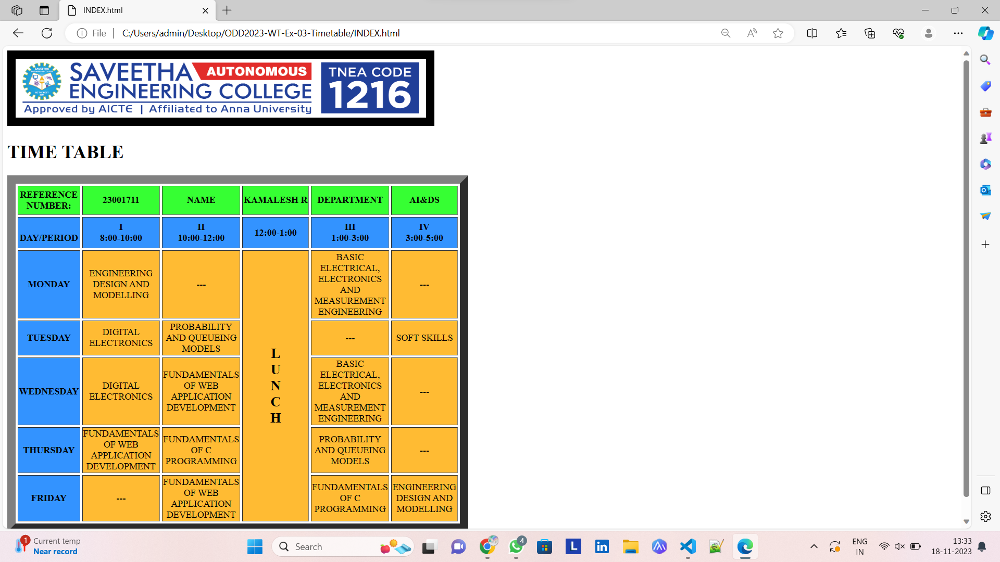

# Ex-04-Timetable
## NAME : KAMALESH R
## REF NO : 23001711
## AIM
To Write a html webpage page to display your timetable.

# ALGORITHM
### STEP 1
create a simple table using table tag
### STEP 2
Add header row using th tag
### STEP 3
Add your timetable
### STEP 4
Execute the program

# CODE
```html
<!DOCTYPE html>
<html>
 
<body>
    <centre>
    

    <h1 align="centre">TIME TABLE</h1>
    <table border="15" cellspacing="4" >
        <!--<caption>Timetable</caption>-->
        <tr align = "center" height="50" width="100" bgcolor="#36FF33">
            <td><b>REFERENCE NUMBER:</b></td>
            <td><b>23001711</b></td>
            <td><b>NAME</b></td>
            <td><b>KAMALESH R</b></td>
            <td><b>DEPARTMENT</b></td>
            <td><b>AI&DS</b></td>
        </tr>
        
        <tr bgcolor="#3393FF">
            <td align="center" height="50"
                width="100"><br>
                <b>DAY/PERIOD</b></br>
            </td>
            <td align="center" height="50"
                width="110">
                <b>I<br>8:00-10:00</b>
            </td>
            <td align="center" height="50"
                width="110">
                <b>II<br>10:00-12:00</b>
            </td>
            <td align="center" height="50"
                width="110">
                <b>12:00-1:00</b>
            </td>
            <td align="center" height="50"
                width="110">
                <b>III<br>1:00-3:00</b>
            </td>
            <td align="center" height="50"
                width="110">
                <b>IV<br>3:00-5:00</b>
            </td>
           
        </tr>
        <tr bgcolor="#FFBB33">
            <td align="center" height="50" bgcolor="#3393FF">
                <b>MONDAY</b></td>
            <td align="center" height="50">ENGINEERING DESIGN AND MODELLING</td>
            <td align="center" height="50">---</td>
            <td rowspan="6" align="center" height="50">
                <h2>L<br>U<br>N<br>C<br>H</h2></td>
            <td align="center" height="50">BASIC ELECTRICAL, ELECTRONICS AND MEASUREMENT ENGINEERING</td>
            <td align="center" height="50">---</td>

        
            
        </tr>
        <tr bgcolor="#FFBB33">
            <td align="center" height="50" bgcolor="#3393FF">
                <b>TUESDAY</b>
            </td>
            
            <td align="center" height="50">DIGITAL ELECTRONICS</td>
            <td align="center" height="50">PROBABILITY AND QUEUEING MODELS</td>
            <td align="center" height="50">---</td>
            <td align="center" height="50">SOFT SKILLS</td>
        </tr>
        <tr bgcolor="#FFBB33">
            <td align="center" height="50" bgcolor="#3393FF">
                <b>WEDNESDAY</b>
            </td>
            <td align="center" height="50">DIGITAL ELECTRONICS</td>
            <td align="center" height="50">FUNDAMENTALS OF WEB APPLICATION DEVELOPMENT</td>
            <td align="center" height="50">BASIC ELECTRICAL, ELECTRONICS AND MEASUREMENT ENGINEERING</td>
            <td align="center" height="50">---</td>
            
        
        </tr>
        <tr bgcolor="#FFBB33" >
            <td align="center" height="50" bgcolor="#3393FF">
                <b>THURSDAY</b>
            </td>
            <td align="center" height="50">FUNDAMENTALS OF WEB APPLICATION DEVELOPMENT</td>
            <td align="center" height="50">FUNDAMENTALS OF C PROGRAMMING</td>
            <td align="center" height="50">PROBABILITY AND QUEUEING MODELS</td>
            <td align="center" height="50">---</td>
        </tr>
        <tr bgcolor="#FFBB33">
            <td align="center" height="50" bgcolor="#3393FF">
                <b>FRIDAY</b>
            </td>
            <td align="center" height="50">---</td>
            <td align="center" height="50">FUNDAMENTALS OF WEB APPLICATION DEVELOPMENT</td>
            <td align="center" height="50">FUNDAMENTALS OF C PROGRAMMING</td>
            <td align="center" height="50">ENGINEERING DESIGN AND MODELLING</td>
        </tr>
        
    </table>
</body>
 
</html>`
```


# OUPUT


# RESULT

Thus we display the timetable of us using HTML webpage successfully.
